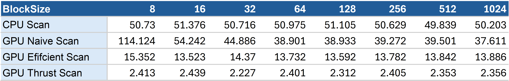
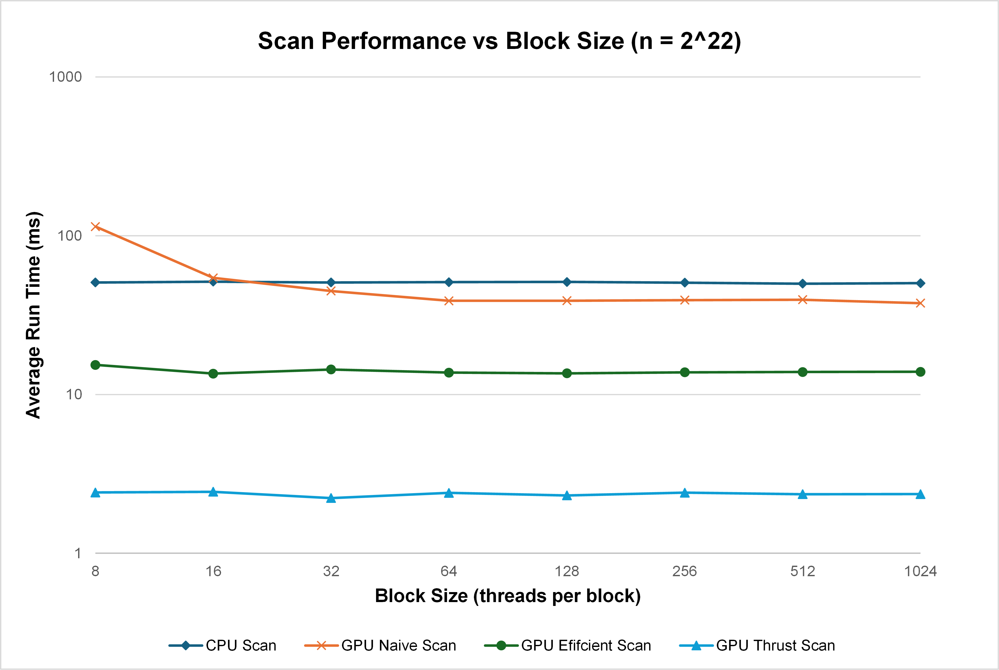
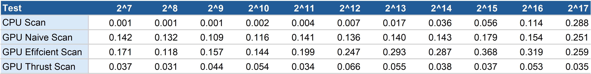
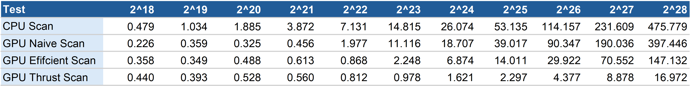
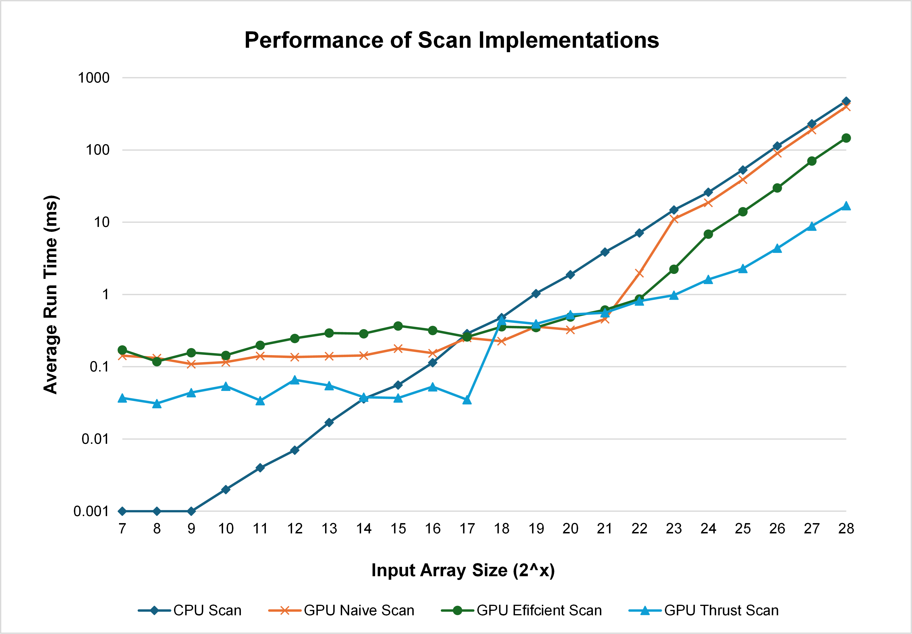
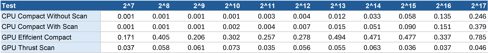
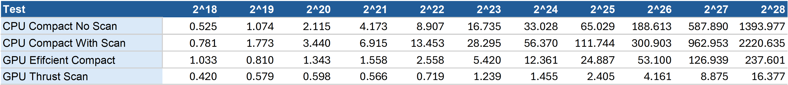
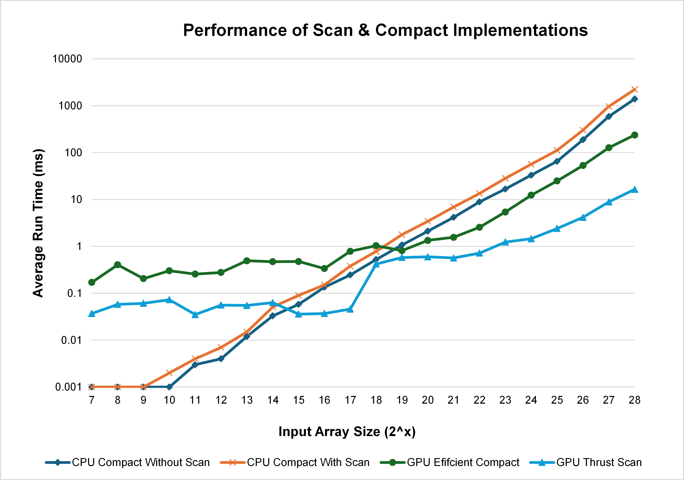
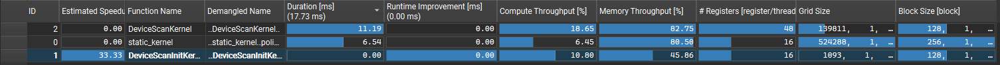
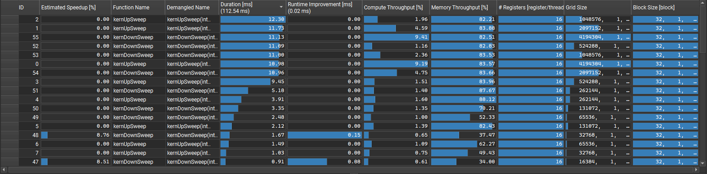

# CUDA Stream Compaction

## Project Introduction
> University of Pennsylvania **CIS5650 – GPU Programming and Architecture**  
> - Jacky Park  
> - Tested on: Windows 11, i9-13900H @ 2.60 32 GB, RTX 4070 (Laptop GPU) 8 GB (Personal Machine: ROG Zephyrus M16 GU604VI_GU604VI)

This project explores different implementations of **scan** (prefix sum) and **stream compaction** on both CPU and GPU.  

- **Scan**: an exclusive prefix sum, where each element becomes the sum of all previous values.  
- **Stream compaction**: removing unwanted elements, in this case filtering out `0`s.  

These are fundamental building blocks in parallel computing, and they show up everywhere from sorting to rendering pipelines. The project starts with a CPU reference, then moves through increasingly optimized GPU versions, and finally compares them to Thrust’s built-in implementation.

## Implementation Approaches

### 1. CPU Baseline

Functions:  
- `StreamCompaction::CPU::scan`  

The CPU version sets the **ground truth** for correctness.  

- **Scan** is just a `for` loop that accumulates into an output array. Simple, but it makes sure we have the right answers to compare against later.  

It’s still sequential, but it sets up the exact operations we’ll replicate in parallel on the GPU.


### 2. Naive GPU Scan

Function:  
- `StreamCompaction::Naive::scan`

This version follows the "naive" parallel scan algorithm described in [GPU Gems 3 (O39.2.1)](https://developer.nvidia.com/gpugems/gpugems3/part-vi-gpu-computing/chapter-39-parallel-prefix-sum-scan-cuda).  

In each iteration, every element looks back a certain distance and adds its neighbor. First distance 1, then 2, then 4, doubling until the array is done. That means `ilog2ceil(n)` iterations, with one kernel launch per step.   The performance is better than the CPU for large sizes, but it’s still not very efficient.


### 3. Work-Efficient GPU Scan and Compaction

Functions:  
- `StreamCompaction::Efficient::scan`  
- `StreamCompaction::Efficient::compact`  
- `StreamCompaction::Common::kernMapToBoolean`  
- `StreamCompaction::Common::kernScatter`

This is where things get faster. The work-efficient scan is based on the Blelloch algorithm described in [GPU Gems 3 (O39.2.2)](https://developer.nvidia.com/gpugems/gpugems3/part-vi-gpu-computing/chapter-39-parallel-prefix-sum-scan-cuda).  

#### Scan  
It runs in two phases:  
1. **Upsweep**: build a binary tree of partial sums.  
2. Set the last element to zero to prepare for exclusivity.  
3. **Downsweep**: walk back down the tree, writing prefix sums in place.  

The result is a scan that does only **O(n)** total work, instead of repeatedly touching the same values like the naive method. It also works in place with just one array.

#### Stream Compaction  
Compaction is built from three steps:  
1. Map the input to a boolean array (non-zero → 1, zero → 0).  
2. Scan that array.  
3. Scatter the non-zero values into their new compacted positions.  

On the GPU, all three steps are easy to parallelize, and the whole thing runs much faster than the CPU version (That is, if the array we're working on is large enough. More details in the test data later!). 

### 4. Thrust Implementation

Function:  
- `StreamCompaction::Thrust::scan`

The final version uses [NVIDIA’s Thrust library](https://developer.nvidia.com/thrust).  

It’s essentially a one-liner wrapping `thrust::exclusive_scan`, with device vectors handling the memory details. Thrust also provides `remove_if` for stream compaction, which achieves the same effect in a single call.  

This gives us a performance ceiling. The Thrust version is heavily optimized and tuned for real workloads, so our custom implementations can be judged against it.

## Results

### Block Size Exploration

Before diving into benchmarks for each scan implementation, I wanted to test how **block size** (threads per block) impacts performance.  

I expected block sizes **below 32** to perform poorly. Since GPU threads execute in groups of 32 (called a *warp*), a block size under 32 means some threads in every warp are left idle, wasting compute capacity. This exact issue showed up in my [CUDA Boids implementation](https://github.com/jackypark9852/Project1-CUDA-Flocking?tab=readme-ov-file#impact-of-block-size-on-performance).  

What I wasn’t sure about was how **larger block sizes** would behave. On Ada Lovelace GPUs, each SM can support up to **1536 threads concurrently**. A very large block size (like 1024) might actually reduce SM occupancy, since only one or two blocks could fit per SM at a time. That could limit how well the GPU hides latency.  

Speculation aside, here are the results. I ran each scan implementation on arrays of size **2^22**, repeating the test 10 times and reporting the average runtime in *milliseconds (ms)*.

<p align="center">
  
</p>

<p align="center">
  
</p>

Surprisingly, for both the **efficient scan** and the **Thrust scan**, changing the block size didn’t really matter. Their runtimes stayed consistent across the board.  

The **naive scan** told a different story. Performance improved steadily up to a block size of 64, after which things flattened out. Larger sizes, even as big as 1024, didn’t make a noticeable difference.  

Why is that? I’m not entirely sure yet. My guess is that the limiting factor isn’t occupancy, but something else in the kernel like memory bandwidth or synchronization. A deeper profiling session in **Nsight Compute** would probably reveal the real bottleneck.  

For now, a block size of **32 threads** looked like a solid baseline across all implementations. All subsequent benchmarks were run with this configuration.

--- 

### Scan Implementation Benchmarking

With the block size fixed at 32, I benchmarked each scan implementation across input sizes from **2^7 up to 2^28**. Beyond 2^28, the CPU version took too long to be practical, so I capped the tests there. All results are in **milliseconds (ms)**.

<p align="center">
  
</p>

<p align="center">
  
</p>

<p align="center">
  
</p>

### Observations

1. The **CPU implementation** was surprisingly competitive at small sizes. It outperformed all GPU scans up to about **2^13**. It even held its own until around **2^17**, when Thrust and the naive/efficient scans finally pulled ahead.  

2. The **naive scan** only started to show meaningful gains over the CPU once the arrays grew beyond **2^17**. Before that, the overhead overshadowed any parallelism benefits.

3. The **work-efficient scan** was actually *slower* than the naive approach until roughly **2^21**, after which its asymptotic advantage started to matter.  

4. **NVIDIA’s Thrust implementation** was the clear winner among the GPU approaches. The only odd case was a sudden dip at **2^18**, which I suspect is tied to internal scheduling or memory effects.  

Looking across the results, the story makes sense. For smaller inputs, both the CPU and naive scans hold their ground. The CPU wins early on because launching GPU kernels has a cost, and the naive scan is especially inefficient at small sizes due to all the idle threads created by the way it’s structured. In those cases, the CPU can just crunch through the data with more efficiency.  

The work-efficient scan is designed to save operations in the long run, but that comes at the price of overhead. Each level of the binary tree requires separate kernel launches, and we end up launching on the order of `log(n)` kernels. For small arrays, this overhead dominates, which is why the naive scan actually looks better until around **2^21**. Past that point, the savings from reduced work finally outweigh the extra launches, and work-efficient pulls ahead.  

Thrust is in a league of its own. It’s heavily optimized under the hood, probably using tricks like minimizing global memory traffic and maximizing occupancy. That explains why it consistently edges out the others, aside from the weird hiccup at **2^18**. Without digging into Nsight Compute or the library source, it’s hard to say exactly what happens there.  

Overall, this benchmark highlights how **algorithmic overhead vs. raw work savings** plays out at different scales:  
- CPU and naive are great for small arrays.  
- Work-efficient needs larger arrays before its advantages show.  
- Thrust is simply the best tuned implementation, as long as the array size is large enough. 

### Compact Performance Benchmarking  

I also tested the compact functions that build on top of the scan implementations. Since there is no compact version built on the naive scan or Thrust scan, those entries are left as-is in the data. If compact functions were written for them, I would expect extra overhead from the additional **mapping** and **scattering** kernels.  

The results were mostly in line with expectations:  

- At small input sizes, the **CPU compact without scan** was by far the fastest. Skipping the scan step makes it very lightweight.  
- As array sizes grew, the **work-efficient compact** eventually pulled ahead, benefiting from the same asymptotic improvements we saw in its scan counterpart.  
- Given how fast Thrust’s scan is, a full compact built on top of it would almost certainly be the fastest option overall.  

<p align="center">
  
</p>

<p align="center">
  
</p>

<p align="center">
  
</p>

## Scan Performance Profiling

To dig deeper into why **Thrust often outperforms my work-efficient scan**, I profiled both implementations with **Nsight Compute**. My goals were:  

1. Understand at a high level how the two approaches differ at the kernel level. Even without full source access, I want a reasonable picture of the contrast.  
2. Compare resource utilization side by side, so I can see where my implementation pays overhead and where Thrust gains efficiency.  

### Results

<p align="center">
  
</p>

The first surprise is kernel count. Thrust’s scan shows **three kernels** total in the timeline. My work-efficient version launches **`upsweep` and `downsweep` about log2(n) times each**, so the difference is stark.

For comparison, here is the same Nsight view on my work-efficient scan:

<p align="center">
  
</p>

Even worse, a **single** `kernUpSweep` slice can take as long as Thrust’s entire scan kernel. That stings.

Looking inside Thrust’s main `DeviceScanKernel`, the counters tell a consistent story:

1. **Higher compute throughput**: 18.65% vs 9.19% for my kernel.  
2. **Higher L1 and L2 cache throughput**: L1 is 18.96% vs 14.81%. L2 is 19.87% vs 17.16%.  
3. **Far fewer threads launched**: 17,895,808 vs 134,217,728.  
4. **Higher theoretical occupancy**: 83.33% vs 50%.

### Why this makes sense

My implementation pays a lot of overhead. I’m launching a ton of kernels, bouncing data back and forth through global memory, and syncing between upsweep and downsweep. On paper the algorithm is “work-efficient,” but at the scale I’m testing, the overhead is what actually dominates.

It is also very likely memory-bound. I do not use shared memory at all, so every step goes straight to global memory. On top of that, the access pattern in upsweep and downsweep is not very friendly. Threads are probably hopping around in the array in a way that leads to frequent cache misses. Even though the arithmetic is trivial, memory stalls end up dragging performance down.

Thrust, on the other hand, clearly does something much leaner. It only launches three kernels total, uses far fewer threads, and manages better cache utilization. I do not know exactly how it is structured under the hood, but I would guess it avoids the repeated global memory passes that my version does, and stages more work in shared memory before writing back. Since arithmetic is cheap and DRAM is slow, just cutting down those global accesses could explain a lot of the speedup.

The occupancy numbers also tell me that Thrust is simply doing more useful work per block. My version fragments the workload across many small kernels, while Thrust seems to keep warps busier and hide memory latency more effectively.

### What I’d try next

- **Fuse phases** so there are fewer kernel launches.  
- **Do more work per thread** instead of spreading it thin.  
- **Use shared memory more aggressively** so I’m not constantly writing intermediates to global memory.  
- **Profile with Nsight Compute** to see if the bottlenecks are really memory stalls, or something else I’m overlooking

## Example Output 
```
Running with SIZE=2^28 (268435456), NPOT=268435453, runs=5

****************
** SCAN TESTS **
****************
    [  16  19  32  47   6  16  37  42  12  47  25   1  41 ...   5   0 ]
cpu scan, power-of-two (ms)
: 427.936 | 420.108 | 429.114 | 415.674 | 427.657
avg: 424.098 ms

cpu scan, non-power-of-two (ms)
: 416.624 | 416.839 | 445.023 | 447.878 | 425.726
avg: 430.418 ms
    passed

naive scan, power-of-two (ms)
: 374.607 | 357.409 | 356.598 | 355.950 | 355.814
avg: 360.076 ms
    passed

naive scan, non-power-of-two (ms)
: 414.850 | 355.830 | 355.463 | 356.068 | 355.346
avg: 367.511 ms
    passed

work-efficient scan, power-of-two (ms)
: 123.602 | 109.718 | 110.412 | 109.744 | 109.850
avg: 112.665 ms
    passed

work-efficient scan, non-power-of-two (ms)
: 109.708 | 109.801 | 110.329 | 110.081 | 109.870
avg: 109.958 ms
    passed

thrust scan, power-of-two (ms)
: 14.754 | 12.387 | 14.174 | 12.664 | 14.861
avg: 13.768 ms
    passed

thrust scan, non-power-of-two (ms)
: 14.619 | 12.657 | 15.252 | 14.284 | 13.075
avg: 13.977 ms
    passed


*****************************
** STREAM COMPACTION TESTS **
*****************************
    [   3   3   1   3   0   1   0   1   0   3   2   2   3 ...   1   0 ]
cpu compact without scan, power-of-two (ms)
: 603.652 | 593.497 | 540.691 | 538.506 | 558.862
avg: 567.042 ms
    [   3   3   1   3   1   1   3   2   2   3   3   2   3 ...   1   1 ]
    passed
cpu compact without scan, non-power-of-two (ms)
: 559.506 | 548.087 | 554.295 | 589.450 | 564.855
avg: 563.239 ms
    [   3   3   1   3   1   1   3   2   2   3   3   2   3 ...   1   2 ]
    passed
cpu compact with scan (ms)
: 922.446 | 947.526 | 939.519 | 993.427 | 910.682
avg: 942.720 ms
    passed
work-efficient compact, power-of-two (ms)
: 348.703 | 185.831 | 187.355 | 186.687 | 188.540
avg: 219.423 ms
    passed
work-efficient compact, non-power-of-two (ms)
: 212.734 | 187.699 | 185.941 | 186.789 | 194.814
avg: 193.596 ms
    passed
Press any key to continue . . .
```